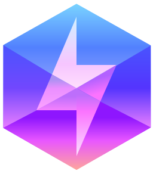

<p align="center">
  
</p>

<h1 align="center">Qwik + Astro</h1>

<p align="center">
  Render <a href="https://qwik.dev/">Qwik</a> components in <a href="https://astro.build/">Astro</a>.
  <br />Zero hydration. Instant interactivity. HTML until users care.
</p>

<p align="center">
  <a href="https://qwik.dev/astro">Documentation</a> · <a href="https://github.com/QwikDev/astro/issues">Report an Issue</a> · <a href="https://discord.com/channels/842438759945601056/1150941080355881080">Discord</a>
</p>

---

## Quick Start

```bash
npm create @qwik.dev/astro@latest
```

Or add to an existing Astro project:

```bash
npx astro add @qwik.dev/astro
```

For full installation instructions, guides, and API reference, visit **[qwik.dev/astro](https://qwik.dev/astro)**.

## Contributing

See our [Contributing Guide](https://qwik.dev/astro/contributing) to get started.

## Help

Reach out in the [Qwik Discord](https://discord.gg/p7E6mgXGgF), there's a dedicated [#qwik-astro](https://discord.com/channels/842438759945601056/1150941080355881080) channel. You can also [open an issue](https://github.com/QwikDev/astro/issues).

## Maintainers

- [Jack Shelton](https://twitter.com/TheJackShelton)
- [Sigui Kessé Emmanuel](https://twitter.com/siguici)
